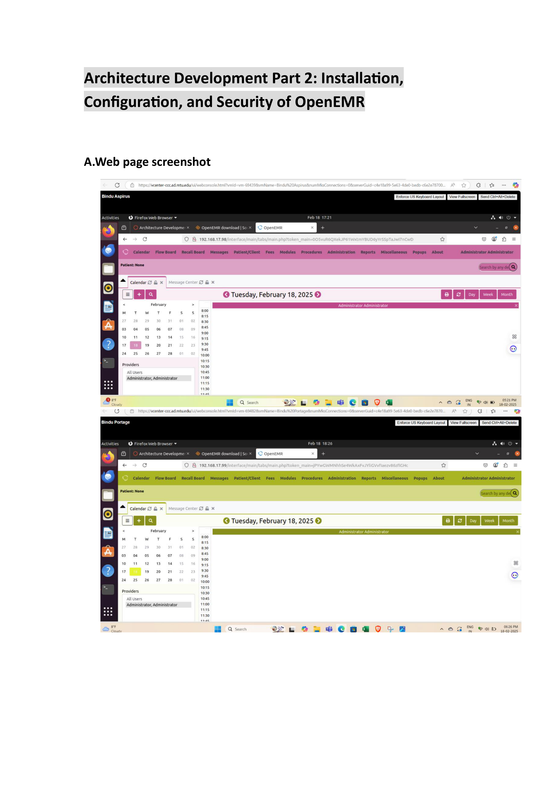

Public-Health-Disease-Surveillance
# 🏥 Public Health Disease Surveillance Architecture

This project demonstrates a simulated public health emergency architecture using OpenEMR, HL7 FHIR, and HAPI-FHIR in a multi-hospital virtual machine setup.

## 🖼️ Architecture Diagram

## ⚙️ Technologies Used
- OpenEMR (EHR)
- HL7 FHIR
- HAPI FHIR Server
- Ubuntu
- Postman
- UFW & Apache Security Configuration

## 🔐 Security Measures
- Enabled UFW firewall (HTTP, HTTPS, SSH)
- Apache headers: X-XSS-Protection, X-Frame-Options, etc.
- Updated Ubuntu and enabled unattended upgrades

## 📤 Interoperability
Used Postman to POST FHIR bundles to the UPHIE intercept point via port `8090`.

## 👩‍💻 Personal Contribution
- Installed OpenEMR on all 4 hospital VMs
- Enabled FHIR output
- Configured security
- Tested HAPI-FHIR interaction via Postman

📅 **Final Submission: April 18, 2025**
